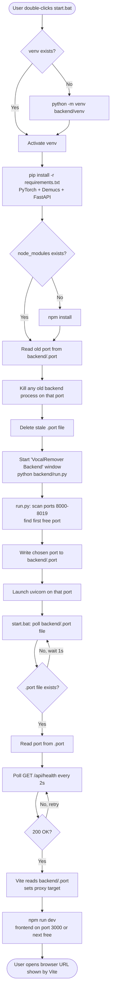
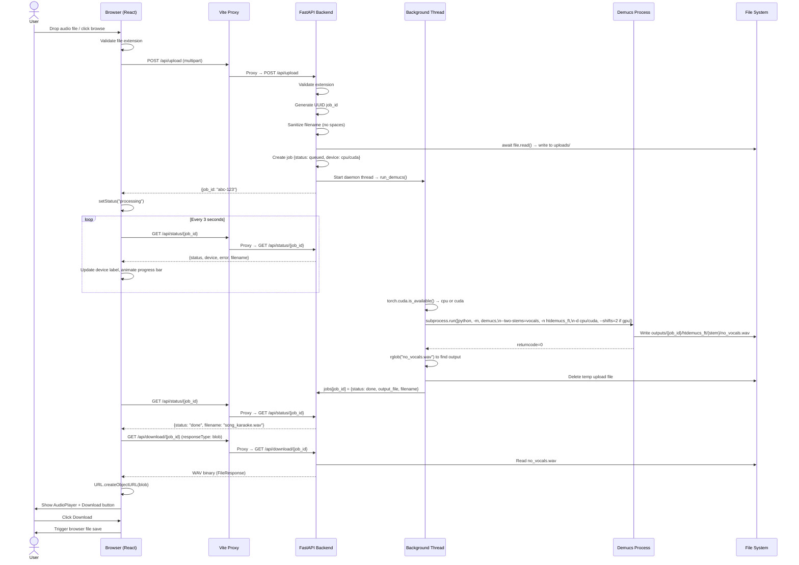
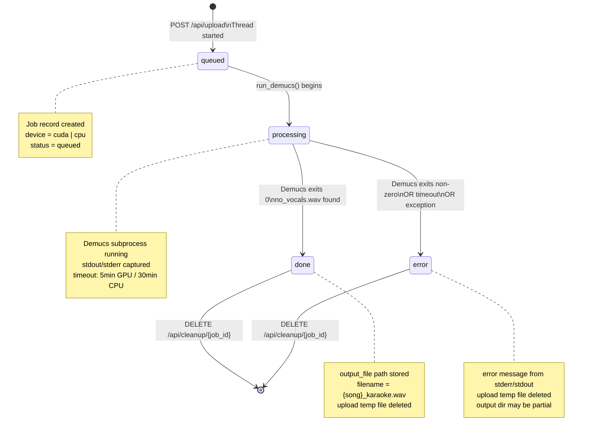
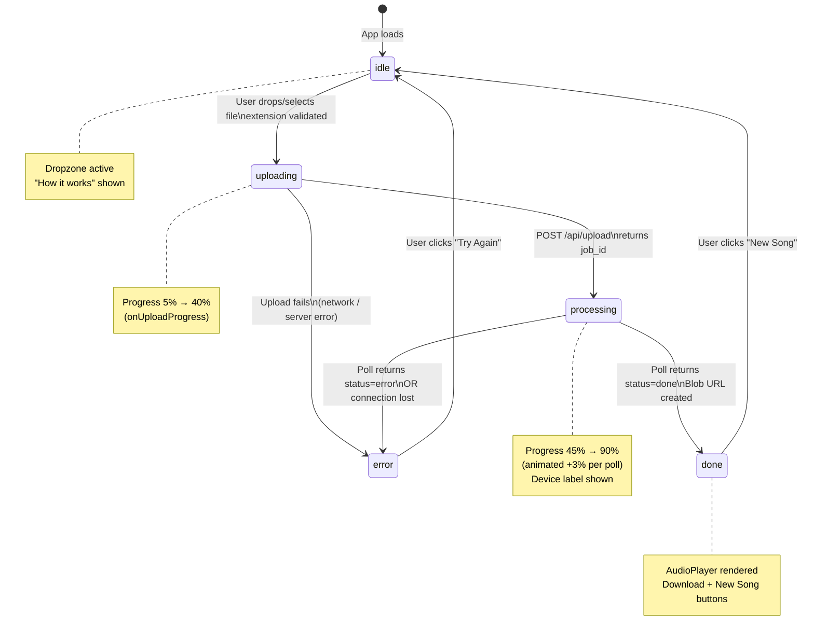

# karaoke-ai — Technical Documentation

> Complete breakdown of the stack, architecture, data flow, and design decisions.

---

## Table of Contents

1. [Project Overview](#1-project-overview)
2. [Tech Stack](#2-tech-stack)
3. [Architecture Overview](#3-architecture-overview)
4. [System Flow Diagrams](#4-system-flow-diagrams)
   - [Startup Flow](#41-startup-flow)
   - [Upload & Processing Flow](#42-upload--processing-flow)
   - [Backend Job Lifecycle](#43-backend-job-lifecycle)
   - [Frontend State Machine](#44-frontend-state-machine)
5. [Layer-by-Layer Breakdown](#5-layer-by-layer-breakdown)
   - [Startup Layer](#51-startup-layer-installbat--startbat--runpy)
   - [Backend Layer](#52-backend-layer-fastapi--uvicorn)
   - [AI Model Layer](#53-ai-model-layer-demucs--pytorch)
   - [Frontend Layer](#54-frontend-layer-react--vite--tailwind)
   - [Communication Layer](#55-communication-layer-rest-api--polling)
6. [Key Design Decisions](#6-key-design-decisions)
7. [File & Directory Structure](#7-file--directory-structure)

---

## 1. Project Overview

**karaoke-ai** is a locally-running, fully offline web application that removes vocals from any audio file using AI. The user uploads a song, the AI model separates the vocals from the instrumental, and the user downloads a clean karaoke-ready WAV file — with no cloud services, no API keys, and no cost.

| Property | Value |
|----------|-------|
| Type | Local web app (runs on your own machine) |
| Input | MP3, WAV, FLAC, M4A, OGG, AAC, WMA, OPUS |
| Output | High-quality WAV (karaoke / instrumental) |
| AI Model | Demucs `htdemucs_ft` by Meta AI |
| Cost | Free and open source |
| Internet needed | Only on first run (to download model weights ~80MB) |

---

## 2. Tech Stack

### Backend

| Technology | Version | Where Used | Why |
|------------|---------|------------|-----|
| **Python** | 3.9+ | Entire backend | First-class support for AI/ML libraries; Demucs is Python-native |
| **FastAPI** | latest | `backend/main.py` | Modern async web framework with automatic request validation, OpenAPI docs, and type safety. Much faster than Flask for concurrent I/O. |
| **Uvicorn** | latest | Serves FastAPI app | ASGI server — handles async requests correctly. `--reload` flag auto-restarts on code changes during development. |
| **python-multipart** | latest | `POST /api/upload` | Required by FastAPI to parse `multipart/form-data` file uploads. Without this, file upload endpoints crash. |
| **PyTorch** | 2.5.0+cpu | Powers Demucs | The ML framework Demucs is built on. The `+cpu` build avoids the CUDA/FFmpeg dependency entirely, so anyone can install it without a GPU or extra system software. |
| **torchaudio** | 2.5.0+cpu | Audio I/O for Demucs | Provides audio loading/saving operations used internally by Demucs. |
| **Demucs** | 4.0.1 | `run_demucs()` in `main.py` | Meta AI's state-of-the-art audio source separation model. Best free vocal removal quality available. |
| **soundfile** | latest | Demucs audio backend | Provides libsndfile-based WAV reading/writing. Demucs prefers soundfile over torchaudio when available because it requires no FFmpeg. |
| **threading** | stdlib | `main.py` | Demucs is a long-running CPU-bound task. Running it in a background thread prevents it from blocking FastAPI's async event loop, keeping the server responsive to status polls during processing. |
| **torch** (import) | 2.5.0+cpu | `main.py` | Used at startup to detect CUDA availability (`torch.cuda.is_available()`) to decide processing mode. |

### Frontend

| Technology | Version | Where Used | Why |
|------------|---------|------------|-----|
| **React** | 18.3 | `frontend/src/` | Component-based UI. State machine pattern (`idle → uploading → processing → done → error`) maps cleanly onto React's `useState`. |
| **Vite** | 6.x | Dev server + bundler | Extremely fast HMR (Hot Module Replacement). Also acts as a dev proxy — routes `/api/*` requests to the backend, avoiding CORS issues entirely. |
| **Tailwind CSS** | 3.x | All JSX files | Utility-first CSS. No separate stylesheet maintenance needed. Custom `brand-*` color palette and `glass` morphism utility defined in config. |
| **Axios** | 1.7 | `App.jsx` | HTTP client for upload (with `onUploadProgress` callback for the progress bar) and polling. Cleaner than `fetch` for progress tracking. |
| **react-dropzone** | 14.x | `App.jsx` | Handles drag-and-drop + click-to-browse file selection with accessible input handling. |
| **lucide-react** | 0.468 | `App.jsx` | Clean SVG icon set — `Upload`, `Download`, `Mic2`, `Play`, `Pause`, etc. Tree-shakeable, adds minimal bundle size. |
| **PostCSS + Autoprefixer** | latest | Build pipeline | Required by Tailwind to process `@tailwind` directives into real CSS and add vendor prefixes for browser compatibility. |

### Tooling & Infrastructure

| Technology | Where Used | Why |
|------------|------------|-----|
| **Windows Batch (.bat)** | `install.bat`, `start.bat` | One-click setup/launch for Windows users without needing to understand Python venvs or npm. |
| **Python `socket`** | `backend/run.py` | Finds a free TCP port before starting Uvicorn so the backend never crashes due to "port already in use". |
| **`curl`** | `start.bat` | Polls `GET /api/health` to confirm the backend is actually listening before the frontend starts. Avoids the ECONNRESET race condition. |
| **Git + GitHub CLI (`gh`)** | Repository management | Version control and remote hosting. `gh` enables repo creation and push from the command line. |

---

## 3. Architecture Overview

```
┌──────────────────────────────────────────────────────────────────┐
│                        USER'S MACHINE                            │
│                                                                  │
│  ┌─────────────────────┐         ┌──────────────────────────┐   │
│  │     FRONTEND         │         │        BACKEND            │   │
│  │  React + Vite        │◄───────►│  FastAPI + Uvicorn        │   │
│  │  localhost:3000      │  HTTP   │  localhost:8000            │   │
│  │                      │  /api/* │                           │   │
│  │  - Drag & drop UI    │         │  - Upload endpoint        │   │
│  │  - Progress tracking │         │  - Status polling API     │   │
│  │  - Audio preview     │         │  - Download endpoint      │   │
│  │  - Download button   │         │  - In-memory job store    │   │
│  └─────────────────────┘         └──────────┬───────────────┘   │
│                                             │                    │
│                                    background thread             │
│                                             │                    │
│                                   ┌─────────▼──────────┐        │
│                                   │    DEMUCS AI MODEL  │        │
│                                   │  htdemucs_ft        │        │
│                                   │  PyTorch 2.5 CPU/GPU│        │
│                                   │                     │        │
│                                   │  Input:  song.wav   │        │
│                                   │  Output: no_vocals  │        │
│                                   │          .wav       │        │
│                                   └─────────────────────┘        │
│                                                                  │
│  ┌────────────────────────────────────────────────────────────┐  │
│  │                    FILE SYSTEM                              │  │
│  │  backend/uploads/   ← temp input files (auto-deleted)      │  │
│  │  backend/outputs/   ← processed WAV files per job          │  │
│  │  backend/.port      ← active backend port (written by      │  │
│  │                        run.py, read by vite.config.js)     │  │
│  └────────────────────────────────────────────────────────────┘  │
└──────────────────────────────────────────────────────────────────┘
```

**Key architectural principle:** The frontend and backend are completely decoupled. They communicate only through a REST API. The Vite dev server proxies all `/api/*` requests to the backend — the browser never directly talks to port 8000, only to port 3000/3001.

---

## 4. System Flow Diagrams

### 4.1 Startup Flow



### 4.2 Upload & Processing Flow



### 4.3 Backend Job Lifecycle



### 4.4 Frontend State Machine



---

## 5. Layer-by-Layer Breakdown

### 5.1 Startup Layer: `install.bat` / `start.bat` / `run.py`

#### `install.bat` — First-time Setup

**What it does:** Sets up the entire development environment from scratch.

**Step-by-step:**
```
1. Check if backend/venv/Scripts/python.exe exists
   → WHY: python -m venv crashes with Permission Denied if venv already
     exists and python.exe is locked by a running backend process.
     Skipping creation if it already exists avoids this entirely.

2. Activate the virtual environment
   → WHY: Isolates Python packages from the system Python.
     torch, demucs, fastapi are all installed here, not globally.

3. pip install torch==2.5.0+cpu torchaudio==2.5.0+cpu
   --index-url https://download.pytorch.org/whl/cpu
   → WHY: The +cpu suffix packages only exist on PyTorch's own wheel
     server, not on PyPI. Without --index-url, pip cannot find them
     and installation silently fails.

4. pip install fastapi uvicorn python-multipart demucs==4.0.1 soundfile
   → All backend dependencies.

5. cd frontend && npm install
   → Installs React, Vite, Tailwind, Axios, react-dropzone, lucide-react.

6. python -c "from demucs.pretrained import get_model; get_model('htdemucs_ft')"
   → Pre-downloads the ~80MB model weights from the internet.
     If not done here, the first upload attempt triggers the download
     mid-processing, making the first job appear to hang for minutes.
```

#### `start.bat` — Every-run Launcher

**What it does:** Kills any stale backend, starts a fresh backend, waits for it to be healthy, then starts the frontend.

**Key problems it solves:**

| Problem | Solution |
|---------|----------|
| Old backend running stale code after edits | Reads port from `backend/.port`, kills that process via `taskkill /f /pid` before starting fresh |
| Frontend starting before backend is ready (ECONNRESET) | Polls `GET /api/health` every 2s, only proceeds when backend returns 200 |
| Port conflicts on frontend | Vite's `strictPort: false` auto-increments (3000 → 3001 → ...) |
| Port conflicts on backend | `run.py` scans for a free port instead of hardcoding 8000 |
| pip errors hidden | Removed `2>nul` redirection so errors are visible in the terminal |

#### `backend/run.py` — Dynamic Port Allocator

```python
# 1. Scan ports 8000-8019 using socket.bind() to find first free one
# 2. Write the chosen port to backend/.port
# 3. Start uvicorn on that port via subprocess

WHY socket.bind() not netstat:
  socket.bind() is atomic — it either succeeds (port is free) or raises
  OSError (port is in use). netstat output parsing is fragile on Windows.

WHY write to .port file:
  vite.config.js reads this file at startup to configure its proxy target.
  This is the bridge between "backend chose port X" and "frontend proxy
  sends /api/* to port X". Without this, if the backend moves to port
  8001, all API calls from the frontend would fail (proxy still targets 8000).
```

---

### 5.2 Backend Layer: FastAPI + Uvicorn

**File:** `backend/main.py`

#### Why FastAPI over Flask or Django?

- **Async-native:** FastAPI is built on Starlette (ASGI). The upload endpoint uses `await file.read()` — non-blocking I/O that doesn't freeze the server while reading a 30MB file.
- **Auto validation:** File type, request body, and path parameters are validated automatically via Python type hints.
- **Speed:** FastAPI handles concurrent status poll requests from the browser without blocking because each poll is async.

#### Endpoint Design

```
POST /api/upload
  ├── Validates file extension against ALLOWED_EXTENSIONS set
  ├── Generates UUID job_id (prevents collisions, not guessable)
  ├── Sanitizes filename (removes spaces/special chars → path safety on Windows)
  ├── await file.read() → writes bytes to uploads/{job_id}_{name}.ext
  │     WHY await: shutil.copyfileobj() is sync and blocks the event loop.
  │     await file.read() yields control back to the async loop while reading.
  ├── Creates job record in memory: {status, original_name, device}
  ├── Starts daemon thread → run_demucs()
  │     WHY thread not asyncio: Demucs is CPU-bound (subprocess).
  │     asyncio tasks share one thread — a blocking subprocess call would
  │     freeze all /api/status polls. A real OS thread runs concurrently.
  │     daemon=True means the thread won't prevent server shutdown.
  └── Returns {job_id} immediately (non-blocking response)

GET /api/status/{job_id}
  ├── Reads from in-memory jobs dict (no DB needed — single process)
  └── Returns {status, error, filename, device}
        device is returned from first poll so frontend shows correct
        time estimate (GPU: <1min, CPU: 5-10min) during processing.

GET /api/download/{job_id}
  ├── Validates job exists and status == "done"
  └── Returns FileResponse (streams file from disk, never loads into memory)
        WHY FileResponse not reading bytes: a 40MB WAV file streamed
        via FileResponse uses constant memory. Loading it into memory
        to return as bytes would OOM on large files.

DELETE /api/cleanup/{job_id}
  └── Removes outputs/{job_id}/ directory and job record

GET /api/health
  └── Returns {status: "ok"} — used by start.bat polling loop
```

#### In-Memory Job Store

```python
jobs: dict = {}
# {
#   "abc-123": {
#     "status": "processing",   # queued | processing | done | error
#     "original_name": "song.mp3",
#     "device": "cpu",
#     "output_file": "backend/outputs/abc-123/htdemucs_ft/abc-123_song/no_vocals.wav",
#     "filename": "PHIR SE_karaoke.wav",
#     "error": None
#   }
# }
```

**Why not a database?** The app processes one song at a time locally. A SQLite or Redis store would add complexity and a dependency for no benefit. Jobs are ephemeral — they only need to survive the current server session. If the server restarts, old job IDs become invalid anyway (the files are on disk but the memory is gone).

---

### 5.3 AI Model Layer: Demucs + PyTorch

#### What is Demucs?

Demucs (Deep Extractor for Music Sources) is Meta AI's audio source separation model. It uses a hybrid architecture combining:
- **Waveform domain** processing (operates on raw audio samples)
- **Spectrogram domain** processing (operates on frequency representations)

The two-path approach gives it a much richer understanding of audio structure than older models like Spleeter which only used spectrograms.

#### Why `htdemucs_ft` over the base `htdemucs`?

| Model | Architecture | Training | Quality |
|-------|-------------|----------|---------|
| `htdemucs` | Hybrid Transformer | General music separation | Good |
| `htdemucs_ft` | Same architecture | **Fine-tuned** specifically on music benchmarks | Better — especially on edge cases, complex arrangements |

The `_ft` (fine-tuned) variant was further trained on curated high-quality music data after the base model was done. The difference is audible on complex tracks with instruments that occupy similar frequency ranges as vocals (synths, violins, high guitars).

#### Why `--two-stems=vocals`?

Demucs can separate audio into 4 stems (drums, bass, other, vocals) or 2 stems (vocals, no_vocals). We use 2-stem mode because:
- The model is explicitly trained on the binary task: *"isolate vocals vs everything else"*
- It's faster (fewer output channels to compute)
- The "no_vocals" stem is directly what we want — the instrumental track
- In 4-stem mode, recombining drums+bass+other can introduce alignment artifacts

#### Why `--shifts=2` on GPU only?

```
--shifts=N: Runs demucs N times on the same audio, each time shifting
the audio by a different random offset, then averages all N outputs.

Effect:
  - Boundary artifacts (at segment edges) average out → less "watery" sound
  - Vocal bleed (ghost vocals in the instrumental) averages out
  - Each run independently predicts the separation → averaged result is more confident

Cost: N × processing time

On GPU: a 4-minute song takes ~20s → with shifts=2 still ~40s. Acceptable.
On CPU: a 4-minute song takes ~5-8 min → with shifts=2 becomes 10-16 min.
         User-facing that's unacceptably slow, so we skip it on CPU.
         htdemucs_ft alone (no shifts) is already better than base htdemucs with shifts.
```

#### Device Detection

```python
import torch
device = "cuda" if torch.cuda.is_available() else "cpu"
```

This runs at two points:
1. **At upload time** (`/api/upload`) — stored in the job record immediately so the first status poll returns the device, letting the frontend display the correct time estimate.
2. **At processing time** (`run_demucs()`) — used to build the demucs command with `-d cuda` or `-d cpu` and conditionally add `--shifts=2`.

#### Output Path Structure

```
backend/outputs/
└── {job_id}/                           ← one directory per job
    └── htdemucs_ft/                    ← model name (demucs creates this)
        └── {job_id}_{safe_name}/       ← input file stem (demucs creates this)
            ├── vocals.wav              ← isolated vocals (not used)
            └── no_vocals.wav          ← instrumental track (returned to user)
```

The code first tries the exact expected path, then falls back to `rglob("no_vocals.wav")` to find the file anywhere under the job directory. This makes the system resilient to minor demucs version differences in output folder naming.

---

### 5.4 Frontend Layer: React + Vite + Tailwind

#### State Machine in React

The entire UI is driven by a single `status` state variable:

```
"idle"       → Dropzone shown, "How it works" section visible
"uploading"  → Upload progress bar (5% → 40%)
"processing" → Waveform animation, progress bar (45% → 90% animated)
"done"       → AudioPlayer, Download button, New Song button
"error"      → Error panel with actual error message, Try Again button
```

Each state renders a completely different card. This avoids conditional `if/else` chains scattered throughout the JSX — instead each state has its own clean block.

#### Why Polling Instead of WebSockets?

Demucs processing takes 5–10 minutes on CPU. WebSockets are a persistent connection that keeps the server's memory and connection pool occupied. For a low-frequency check (every 3 seconds), polling is:
- Simpler to implement (no WS upgrade, no reconnection logic)
- Stateless on the server (no open socket to manage per client)
- Tolerant to server restarts (next poll attempt just fails and shows an error)
- Adequate for the latency requirements (3s polling vs 1-2s WS latency is irrelevant at 5+ min processing time)

```javascript
// Polling every 3 seconds
pollRef.current = setInterval(async () => {
  const res = await axios.get(`/api/status/${id}`);
  if (res.data.status === "done") { clearInterval(); fetchBlob(); }
  else if (res.data.status === "error") { clearInterval(); showError(); }
  else { animateProgressBar(); }  // still processing
}, 3000);
```

`pollRef` is a `useRef` (not `useState`) because it holds the interval ID — a mutable value that doesn't need to trigger a re-render when changed, and needs to survive across renders to be cleared on `reset()`.

#### Why Axios over Fetch?

`axios` provides `onUploadProgress` callback which the native `fetch` API does not. This is essential for the upload progress bar — without it, the bar can't advance during the upload phase.

```javascript
axios.post('/api/upload', formData, {
  onUploadProgress: (e) => {
    const pct = Math.max(5, Math.round((e.loaded / e.total) * 40));
    setProgress(pct);  // 5% → 40% during upload
  }
})
```

`Math.max(5, ...)` prevents the bar from dropping below 5% (which happens at the start when only a tiny chunk has been sent: `Math.round(0.02 * 40) = 1`).

#### Why Blob URL for Preview?

When processing is done:
```javascript
const fileRes = await axios.get(`/api/download/${id}`, { responseType: "blob" });
const blob = new Blob([fileRes.data], { type: "audio/wav" });
const url = URL.createObjectURL(blob);
setDownloadUrl(url);
```

A Blob URL (`blob://...`) is a browser-managed in-memory reference to the downloaded file data. This means:
- The `<audio>` element can play it without a separate server request
- The download button can use it without a second download
- `URL.revokeObjectURL(url)` on `reset()` releases the memory

Without this, the audio player would need to re-download the file from the server, and the download button would need yet another request.

#### Vite Proxy — Why the Frontend Never Talks to Port 8000

```javascript
// vite.config.js
proxy: {
  "/api": {
    target: `http://localhost:${backendPort}`,
    changeOrigin: true,
  },
},
```

All requests from the browser to `/api/*` are intercepted by Vite's dev server and forwarded to the backend. The browser thinks it's talking to the same origin (port 3000) — no CORS headers needed, no origin issues. The backend still has `allow_origins=["*"]` as a safety net, but in practice the proxy makes CORS irrelevant during development.

`backendPort` is read from `backend/.port` at Vite startup time, so the proxy target is always correct even when the backend auto-selected a port other than 8000.

---

### 5.5 Communication Layer: REST API + Polling

#### API Surface

```
POST   /api/upload          → accepts multipart file, returns job_id
GET    /api/status/{id}     → returns {status, device, error, filename}
GET    /api/download/{id}   → streams no_vocals.wav as audio/wav
DELETE /api/cleanup/{id}    → deletes output files + job record
GET    /api/health          → returns {status: "ok"} (used by start.bat)
```

#### Why Job IDs (UUID v4)?

The upload endpoint returns a job ID immediately, before processing completes. The frontend uses this ID for subsequent status polls. This pattern (called "async job" or "task queue") decouples the long-running work from the HTTP request lifecycle:

```
Without job IDs:  POST /upload → waits 8 minutes → returns file
                  Browser times out after 30-60s. Request fails.

With job IDs:     POST /upload → returns {job_id} in < 1 second
                  GET /status/{id} → polled every 3s (lightweight)
                  GET /download/{id} → called once when done
```

UUID v4 is used (not sequential integers) because:
- Each job maps to a directory on disk (`outputs/{job_id}/`). Predictable IDs (1, 2, 3...) would let a user guess other users' job IDs and download their files. UUIDs are not guessable.

---

## 6. Key Design Decisions

### "Why not use FFmpeg?"

FFmpeg is powerful but adds a complex system dependency. Many Windows users don't have it installed, and getting it on PATH is a common pain point. PyTorch 2.5.0+cpu combined with soundfile can decode/encode WAV and common formats without FFmpeg. This is why `torch==2.5.0+cpu` is pinned — newer versions changed audio backend defaults in a way that requires FFmpeg.

### "Why not stream the upload to Demucs directly?"

The uploaded file must be saved to disk first because Demucs is invoked as a subprocess that takes a file path argument — it can't receive audio over stdin. The temp file is deleted immediately after Demucs finishes (in the `finally` block of `run_demucs`).

### "Why not containerize with Docker?"

The app is targeted at local, personal use on Windows. Docker adds complexity (Docker Desktop, volume mounts, GPU passthrough). The `.bat` scripts achieve the same isolation goal (dedicated venv, pinned dependencies) with no extra software required.

### "Why CPU-only PyTorch by default?"

`torch==2.5.0+cpu` is a 300MB download vs ~2GB for the CUDA build. For a local hobby app, most users don't have an Nvidia GPU or the CUDA toolkit. The CPU build works for everyone. The app still detects and uses GPU automatically at runtime if `torch.cuda.is_available()` returns `True` — the user just needs to reinstall torch with the CUDA build for that to work.

### "Why in-memory job store instead of SQLite?"

This is a single-user local app. The job store never has more than a few entries at a time. SQLite would add a file dependency, schema migrations, and connection management for zero practical benefit. If the server restarts mid-job, the job is lost — but the output file is still on disk and can be recovered manually. Acceptable trade-off for a local tool.

---

## 7. File & Directory Structure

```
karaoke-ai/
│
├── backend/
│   ├── main.py              # FastAPI app: all API endpoints, job store, demucs runner
│   ├── run.py               # Port allocator: finds free port, writes .port, launches uvicorn
│   ├── requirements.txt     # Python deps with --extra-index-url for PyTorch CPU wheels
│   ├── uploads/             # Temp input files (auto-deleted after processing) [gitignored]
│   ├── outputs/             # Processed WAV files, one subdir per job_id [gitignored]
│   ├── .port                # Active backend port number written by run.py [gitignored]
│   └── venv/                # Python virtual environment [gitignored]
│
├── frontend/
│   ├── src/
│   │   ├── App.jsx          # Entire frontend: state machine, upload, polling, player
│   │   ├── main.jsx         # React root mount
│   │   └── index.css        # Tailwind directives + waveform animation keyframes
│   ├── index.html           # HTML shell (Vite entry point)
│   ├── package.json         # npm deps + "type": "module" to silence Node.js warning
│   ├── vite.config.js       # Vite config: reads .port, sets proxy target dynamically
│   ├── tailwind.config.js   # Custom brand-* colors, content paths
│   └── postcss.config.js    # Tailwind + Autoprefixer pipeline
│
├── install.bat              # First-time setup: venv, pip, npm, model pre-download
├── start.bat                # Every-run launcher: kills old backend, starts fresh, waits for health
├── .gitignore               # Excludes venv/, node_modules/, uploads/, outputs/, .port
├── README.md                # Quick-start guide
└── DOCUMENTATION.md         # This file
```

---

*Generated for karaoke-ai — https://github.com/rishabrkb123-collab/karaoke-ai*
