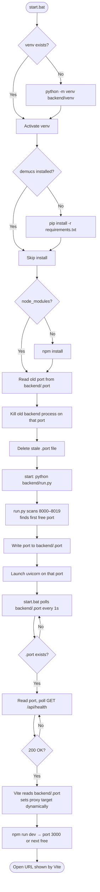
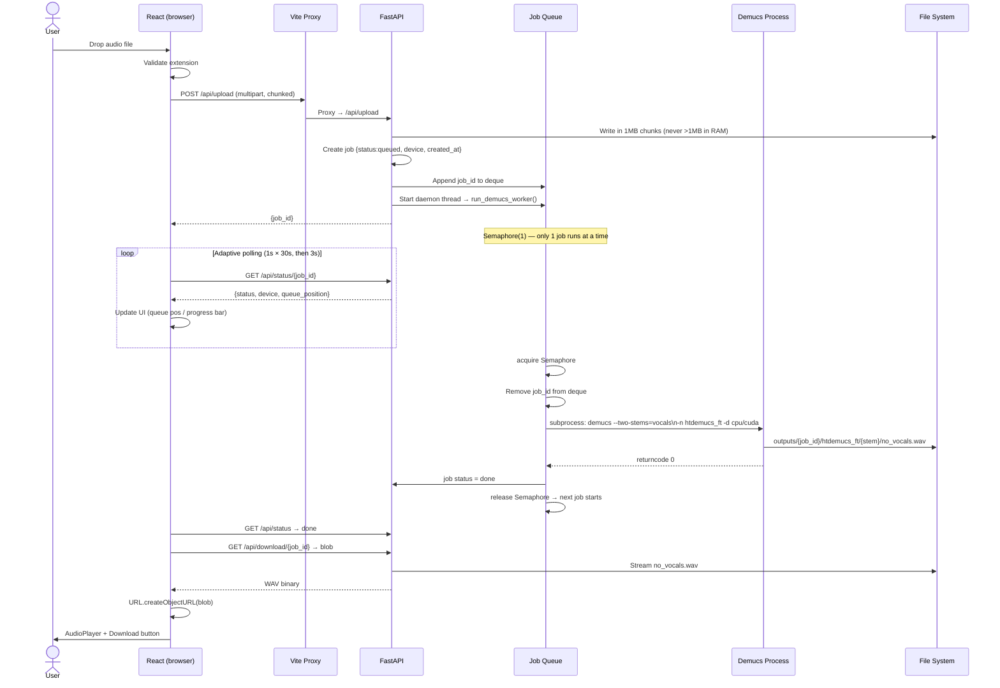
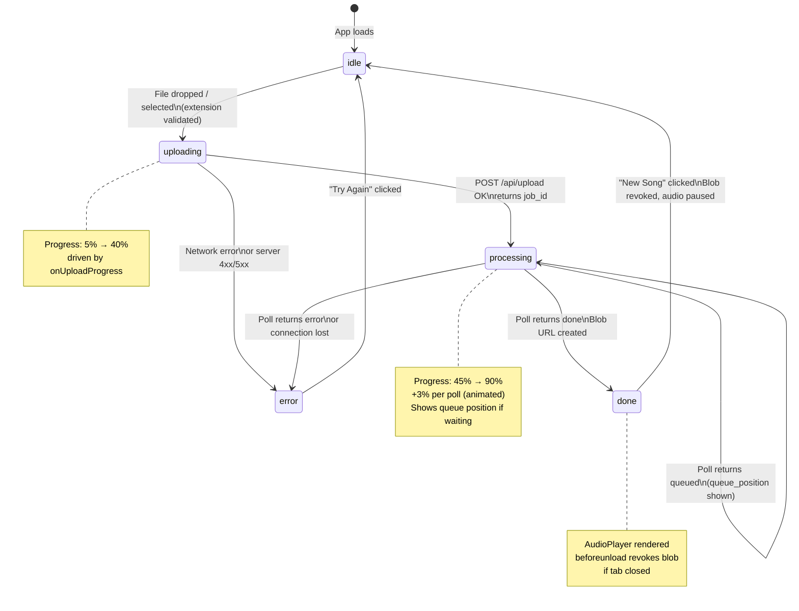

# karaoke-ai

> Free, local, AI-powered vocal remover. Upload any song — get a studio-quality karaoke track. No cloud, no sign-up, no cost.

Powered by **Demucs `htdemucs_ft`** (Meta AI) · Built with **React + FastAPI + PyTorch**

---

## Table of Contents

1. [Features](#features)
2. [Quick Start](#quick-start)
3. [Tech Stack](#tech-stack)
4. [How It Works — Flow Diagrams](#how-it-works--flow-diagrams)
   - [Startup Flow](#startup-flow)
   - [Upload & Processing Flow](#upload--processing-flow)
   - [Frontend State Machine](#frontend-state-machine)
5. [Stack in Detail](#stack-in-detail)
   - [Backend](#backend)
   - [Frontend](#frontend)
   - [AI Model](#ai-model)
   - [Startup Scripts](#startup-scripts)
6. [Project Structure](#project-structure)
7. [Prerequisites](#prerequisites)
8. [Manual Setup](#manual-setup)
9. [License](#license)

---

## Features

- Drag & drop upload — MP3, WAV, FLAC, M4A, OGG, AAC, WMA, OPUS
- AI vocal removal via **Demucs htdemucs_ft** (Meta AI fine-tuned model)
- Auto GPU detection — uses CUDA with `--shifts=2` if available, CPU otherwise
- Job queue — second upload waits cleanly instead of thrashing the CPU
- Built-in audio preview player with scrubber before downloading
- Adaptive status polling — 1s for first 30s, then backs off to 3s
- Auto-cleanup — output files deleted after 2 hours, memory never leaks
- Dynamic port selection — backend and frontend auto-find a free port
- Zero cloud dependency — runs 100% on your own machine

---

## Quick Start

### First time (installs everything)
```bat
install.bat
```

### Every run after that
```bat
start.bat
```

Vite will print the actual local URL — open it in your browser. The backend URL is shown in the separate backend window.

---

## Tech Stack

| Layer | Technology | Version | Role |
|-------|-----------|---------|------|
| **Frontend UI** | React | 18.3 | Component tree, state machine (`idle→uploading→processing→done→error`) |
| **Frontend Build** | Vite | 6.x | Dev server, HMR, `/api` proxy to backend |
| **Frontend Styling** | Tailwind CSS | 3.x | Utility-first CSS, custom `brand-*` palette, glassmorphism |
| **HTTP Client** | Axios | 1.7 | File upload with progress callback, status polling |
| **File Input** | react-dropzone | 14.x | Drag & drop + click-to-browse with accessible input |
| **Icons** | lucide-react | 0.468 | SVG icon set (Upload, Play, Download, etc.) |
| **API Framework** | FastAPI | latest | Async REST API, request validation, OpenAPI |
| **ASGI Server** | Uvicorn | latest | Serves FastAPI, `--reload` for dev |
| **File Upload Parsing** | python-multipart | latest | Parses `multipart/form-data` in FastAPI |
| **AI Model** | Demucs | 4.0.1 | `htdemucs_ft` — vocal/instrumental separation |
| **ML Framework** | PyTorch | 2.5.0+cpu | Powers Demucs, provides `cuda.is_available()` |
| **Audio Backend** | soundfile | latest | WAV read/write without FFmpeg |
| **Port Allocator** | Python socket | stdlib | Finds free port before starting Uvicorn |
| **Startup** | Windows Batch | — | `install.bat`, `start.bat` — one-click setup |

---

## How It Works — Flow Diagrams

### Startup Flow



---

### Upload & Processing Flow



---

### Frontend State Machine



---

## Stack in Detail

### Backend

**FastAPI** (`backend/main.py`) handles four endpoints. Every upload returns a `job_id` immediately — the browser polls `/api/status` while Demucs runs in a background thread.

```python
# POST /api/upload — save file in 1MB chunks, queue job, return immediately
@app.post("/api/upload")
async def upload_song(file: UploadFile = File(...)):
    job_id = str(uuid.uuid4())
    input_path = UPLOAD_DIR / f"{job_id}_{safe_name}{ext}"

    # Chunked write: never loads more than 1MB into RAM at once
    with open(input_path, "wb") as f:
        while chunk := await file.read(1024 * 1024):
            f.write(chunk)

    jobs[job_id] = {"status": "queued", "device": DEVICE, "created_at": time.time()}
    with _queue_lock:
        _job_queue.append(job_id)
    threading.Thread(target=run_demucs_worker, args=(job_id, input_path), daemon=True).start()
    return {"job_id": job_id}
```

```python
# GET /api/status/{job_id} — returns status + queue position
@app.get("/api/status/{job_id}")
async def get_status(job_id: str):
    job = jobs[job_id]
    queue_position = None
    if job["status"] == "queued":
        with _queue_lock:
            queue_position = list(_job_queue).index(job_id) + 1
    return {"status": job["status"], "device": job["device"],
            "queue_position": queue_position, "filename": job.get("filename")}
```

**Job serialization** — a `Semaphore(1)` ensures only one Demucs process runs at a time. A second upload queues behind the first instead of fighting for CPU:

```python
_processing_sem = threading.Semaphore(1)   # only 1 Demucs job at a time
_job_queue: deque = deque()                # tracks waiting job_ids for queue position

def run_demucs_worker(job_id, input_path):
    _processing_sem.acquire()          # blocks here if another job is running
    with _queue_lock:
        _job_queue.remove(job_id)      # no longer waiting
    try:
        run_demucs(job_id, input_path)
    finally:
        _processing_sem.release()      # unblocks next waiting job
```

**Auto-cleanup** — a background `asyncio` task deletes jobs and output files older than 2 hours so the server never accumulates memory or disk:

```python
async def _cleanup_loop():
    while True:
        await asyncio.sleep(3600)
        cutoff = time.time() - 7200       # 2-hour TTL
        for jid, job in list(jobs.items()):
            if job["status"] in ("done", "error") and job["created_at"] < cutoff:
                shutil.rmtree(OUTPUT_DIR / jid, ignore_errors=True)
                jobs.pop(jid, None)
```

---

### Frontend

**React** (`frontend/src/App.jsx`) drives the entire UI through a single `status` state variable. Each value renders a completely different card:

```jsx
// Five exclusive UI states — no nested conditionals
{status === "idle"       && <DropzoneCard />}
{status === "uploading"  && <UploadProgressCard progress={progress} />}
{status === "processing" && <ProcessingCard device={device} queuePosition={queuePosition} />}
{status === "done"       && <ResultCard url={downloadUrl} filename={downloadFilename} />}
{status === "error"      && <ErrorCard message={error} />}
```

**Adaptive polling** — polls every 1s for the first 30s (catches fast GPU jobs), backs off to 3s afterwards. Uses `setTimeout` (not `setInterval`) so the interval can change and two polls never run simultaneously:

```js
const startPolling = useCallback((id) => {
  const pollStart = Date.now();

  const tick = async () => {
    const { data } = await axios.get(`/api/status/${id}`);

    if (data.status === "done") {
      // fetch blob, create object URL, show player
    } else if (data.status === "error") {
      setError(data.error);  setStatus("error");
    } else {
      setProgress(p => Math.min(p + 3, 90));
      const elapsed = Date.now() - pollStart;
      pollRef.current = setTimeout(tick, elapsed < 30_000 ? 1000 : 3000);
    }
  };

  pollRef.current = setTimeout(tick, 1000);
}, []);
```

**Audio player** — `onTimeUpdate` fires up to 30× per second. Throttled to 10fps so re-renders drop from 30/s to 10/s. Audio is explicitly paused and `src` cleared when the component unmounts (user clicks "New Song"):

```jsx
function AudioPlayer({ src, filename }) {
  const lastUpdateRef = useRef(0);

  useEffect(() => {
    return () => {           // runs on unmount
      audioRef.current.pause();
      audioRef.current.src = "";   // releases audio decoder + blob memory
    };
  }, []);

  const handleTimeUpdate = (e) => {
    const now = Date.now();
    if (now - lastUpdateRef.current >= 100) {   // max 10fps
      lastUpdateRef.current = now;
      setCurrentTime(e.target.currentTime);
    }
  };
  // ...
}
```

**Vite proxy** (`frontend/vite.config.js`) — reads the backend port from `backend/.port` at startup, so the proxy always targets the correct port even when the backend auto-selected 8001, 8002, etc.:

```js
import fs from "fs";
import path from "path";
import { fileURLToPath } from "url";

const __dirname = path.dirname(fileURLToPath(import.meta.url));

let backendPort = 8000;
try {
  backendPort = parseInt(fs.readFileSync(
    path.resolve(__dirname, "../backend/.port"), "utf8"
  ).trim(), 10);
} catch {}  // file not written yet — fallback to 8000

export default defineConfig({
  plugins: [react()],
  server: {
    port: 3000,
    strictPort: false,      // auto-increment if 3000 is busy
    proxy: {
      "/api": { target: `http://localhost:${backendPort}`, changeOrigin: true }
    }
  }
});
```

---

### AI Model

**Demucs `htdemucs_ft`** is Meta AI's fine-tuned hybrid transformer model for audio source separation. It combines waveform-domain and spectrogram-domain processing — giving it far better separation quality than older models like Spleeter which only used spectrograms.

```python
# backend/main.py — how Demucs is invoked
DEVICE = "cuda" if torch.cuda.is_available() else "cpu"

cmd = [
    sys.executable, "-m", "demucs",
    "--two-stems=vocals",    # produce vocals.wav + no_vocals.wav
    "-n", "htdemucs_ft",     # fine-tuned model (better than base htdemucs)
    "-d", DEVICE,            # auto GPU/CPU
    "--overlap=0.25",        # segment overlap
    "-o", str(job_output_dir),
]
if DEVICE == "cuda":
    cmd += ["--shifts=2"]    # shift-ensemble on GPU only (2× quality, 2× slower — fine on GPU)

# Output written to:
# outputs/{job_id}/htdemucs_ft/{input_stem}/no_vocals.wav
```

| Model | Type | Quality | Speed (CPU) |
|-------|------|---------|-------------|
| `htdemucs_ft` ← **used here** | Fine-tuned Hybrid Transformer | ⭐⭐⭐⭐⭐ | ~5–8 min |
| `htdemucs` | Hybrid Transformer (base) | ⭐⭐⭐⭐ | ~5–8 min |
| Spleeter | CNN Spectrogram | ⭐⭐⭐ | ~30s |
| Commercial APIs | Varies | ⭐⭐⭐⭐ | ~30s |

`--two-stems=vocals` is used instead of 4-stem separation because the model is explicitly trained on the binary task "isolate vocals vs everything else", giving cleaner results than summing drums+bass+other stems.

---

### Startup Scripts

**`backend/run.py`** — called by `start.bat`. Finds the first free port starting at 8000, writes it to `backend/.port`, then launches Uvicorn. This is why the backend never crashes with "address already in use":

```python
import socket, subprocess, sys, os

def find_free_port(start=8000):
    for port in range(start, start + 20):
        with socket.socket(socket.AF_INET, socket.SOCK_STREAM) as s:
            try:
                s.bind(("", port))   # succeeds = port is free
                return port
            except OSError:
                continue             # port busy, try next

port = find_free_port()
open(".port", "w").write(str(port))  # Vite reads this for proxy target
subprocess.run([sys.executable, "-m", "uvicorn", "main:app",
                "--host", "0.0.0.0", f"--port={port}", "--reload"])
```

**`start.bat`** — kills any stale backend, waits for health check before launching frontend. Skips `pip install` if Demucs is already installed (saves 5–10s on every launch):

```bat
:: Skip install if packages already present
pip show demucs >nul 2>&1
if errorlevel 1 (
    pip install -q -r backend\requirements.txt
) else (
    echo   Already installed.
)

:: Kill old backend, start fresh
start "VocalRemover Backend" cmd /k "python run.py"

:: Wait for backend to be actually ready before starting frontend
:wait_health_loop
curl -s --max-time 1 http://localhost:%BACKEND_PORT%/api/health >nul 2>&1
if not errorlevel 1 goto backend_ready
timeout /t 2 /nobreak >nul
goto wait_health_loop

:backend_ready
cd frontend && npm run dev
```

---

## Project Structure

```
karaoke-ai/
├── backend/
│   ├── main.py              # FastAPI: all endpoints, job queue, Demucs runner, auto-cleanup
│   ├── run.py               # Port allocator: finds free port, writes .port, starts Uvicorn
│   ├── requirements.txt     # Python deps (--extra-index-url for PyTorch CPU wheels)
│   ├── uploads/             # Temp input files — deleted after each job  [gitignored]
│   ├── outputs/             # Processed WAV files per job_id             [gitignored]
│   ├── .port                # Active backend port written by run.py      [gitignored]
│   └── venv/                # Python virtual environment                 [gitignored]
│
├── frontend/
│   ├── src/
│   │   ├── App.jsx          # Full UI: state machine, upload, polling, audio player
│   │   ├── main.jsx         # React root mount
│   │   └── index.css        # Tailwind directives + waveform animation keyframes
│   ├── index.html           # HTML shell
│   ├── package.json         # npm deps + "type":"module"
│   ├── vite.config.js       # Reads .port, configures proxy target dynamically
│   ├── tailwind.config.js   # Custom brand-* color palette
│   └── postcss.config.js    # Tailwind + Autoprefixer build pipeline
│
├── install.bat              # First-time: venv, pip, npm, model pre-download
├── start.bat                # Every run: kill old backend, start fresh, health-check, launch
├── .gitignore
├── README.md                # This file
└── DOCUMENTATION.md         # Full technical deep-dive with architecture diagrams
```

---

## Prerequisites

| Requirement | Version | Link |
|------------|---------|------|
| Python | 3.9+ | [python.org](https://www.python.org/) |
| Node.js | 18+ | [nodejs.org](https://nodejs.org/) |
| Disk space | ~2GB | For PyTorch + Demucs model weights |
| GPU (optional) | CUDA-capable Nvidia | Reduces processing from 5–8 min → <1 min |

---

## Manual Setup

If you prefer not to use the `.bat` files:

### Backend
```bash
cd backend
python -m venv venv
venv\Scripts\activate                    # Windows
# source venv/bin/activate              # Mac / Linux

# PyTorch CPU wheels are on PyTorch's index, not PyPI
pip install torch==2.5.0+cpu torchaudio==2.5.0+cpu \
    --index-url https://download.pytorch.org/whl/cpu

pip install fastapi "uvicorn[standard]" python-multipart demucs==4.0.1 soundfile

# Pre-download the AI model (~80MB, one-time)
python -c "from demucs.pretrained import get_model; get_model('htdemucs_ft')"

python run.py          # starts on first free port from 8000
```

### Frontend (separate terminal)
```bash
cd frontend
npm install
npm run dev            # starts on port 3000 (or next free)
```

Open the URL shown by Vite.

---

## License

MIT — free to use, modify, and distribute.

---

> For full architecture details, design decisions, and in-depth explanations see [DOCUMENTATION.md](./DOCUMENTATION.md).
